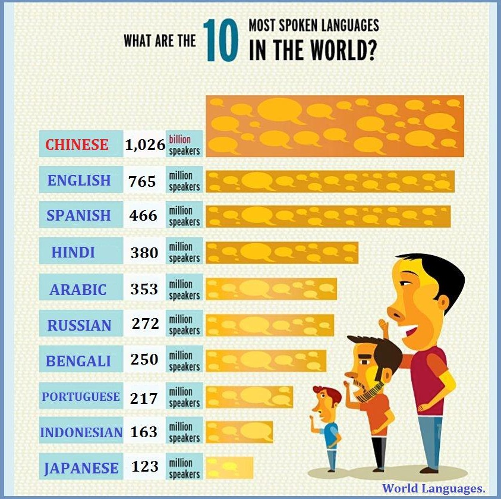
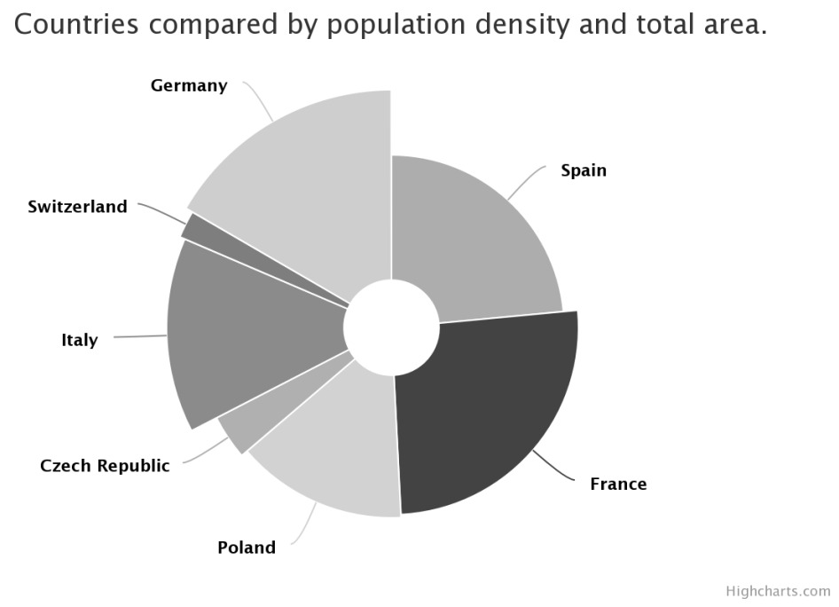
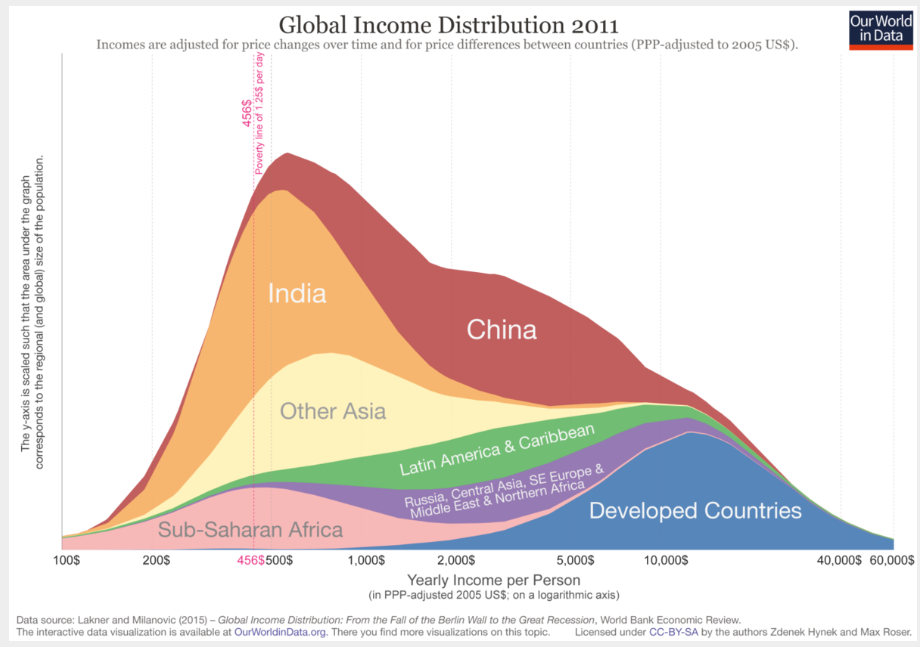

### Load packages

```{r load-packages, message = FALSE, warning=FALSE}
library(tidyverse)
library(ggplot2)
```


# Questioning data visualisations

## Image 1

```{r echo=FALSE, out.width="100%"}

```

_Write your comments about image 1 below_
Scale is wrong, English is the same size as Spanish. 


## Image 2

```{r echo=FALSE, out.width="100%"}

```

_Write your comments about image 2 below_
No information about color scaling, size.


## Image 3

```{r echo=FALSE, out.width="100%"}
knitr::include_graphics("img/life-expectancy-rule-of-law.png")
```

_Write your comments about image 3 below_
Can't read anything from the graph, too much information overlaying different points. No units on the axis. Some of the points are different sizes without any clear reason why. + random colors. 


## Image 4

```{r echo=FALSE, out.width="100%"}

```

_Write your comments about image 4 below_
Exponential scaling on the x axis. Overlaying graphs make the data hard to read.


# Exercises

```{r load-data-staff, message=FALSE, eval=TRUE}
staff <- read_csv("data/instructional-staff.csv")
```


## Exercise 1

What is the difference between *wide format* data and *long format* data?

-Long format is easier to merge tables together 
-wide data is good for visualisation
-Long data good for more dense data storage 

Is the format `staff` data *wide* or *long*?
It is wide data becuase there are multipe attirbutes that could be under one attribute name ie year


How many observations are there in the data set?
5


## Exercise 2

```{r pivoting}
## Uncomment and complete the following code

staff_long <- staff %>%
  pivot_longer(
    cols = "1975":"2011", 
    names_to = "year",
    values_to = "percent"
    ) %>%
  print(staff_long)

```


## Exercise 3

```{r dot-plot}
ggplot(data = staff_long,
       mapping = aes(x = year, 
                     y = percent, 
                     colour = faculty_type)) +
  geom_point()


```

## Exercise 4

```{r bad-line-plot}
ggplot(data = staff_long,
       mapping = aes(x = year, 
                     y = percent, 
                     colour = faculty_type)) +
  geom_line()


```

## Exercise 5

```{r mutate-year}

staff_long <- staff_long %>%
  mutate(year = as.numeric(year))
```


```{r working-line-plot}
ggplot(data = staff_long,
       mapping = aes(x = year, 
                     y = percent, 
                     colour = faculty_type)) +
  geom_line()


```

## Exercise 6

```{r better-line-plot}
# Write your code for Exercise 6 here
ggplot(data = staff_long,
       mapping = aes(x = year, 
                     y = percent, 
                     colour = faculty_type)) +
  geom_line() +
  labs(
    title = "Trends in instructional Staff Employment Status, 1975-2011",
    y = "Percent of Total Instructional Staff",
    x = " Year"
  )


```

## Exercise 7

_Write below your ideas for adapting the line plot_

* Idea 1 - Make a proportion bar graph for each faculty, for each year.
* Idea 2 - Box graph of actual percentage change.

* ...


## Exercise 8

```{r implement-Ex7}
# Write your code for Exercise 8 here


```

